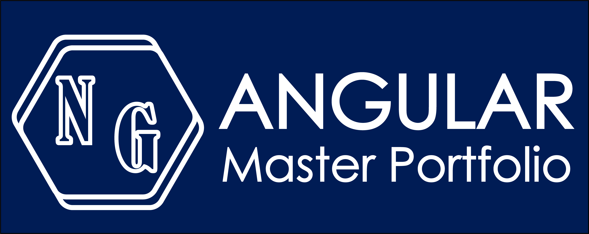
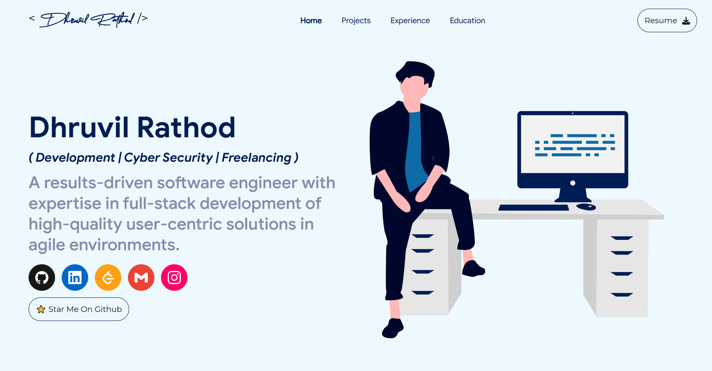

<p align="center"> 
    </img>
</p>

<h1 align="center"> Angular Master Portfolio 🔥 </h1> 
<h3 align="center"> A clean, beautiful, responsive, and 100% customizable portfolio template developed with Angular and SCSS! <h3>

<p align="center"> 
    <a href="https://angular-master-portfolio.web.app/" target="_blank">
    </img>
  </a>
</p>

:star: Star us on GitHub — it helps!

# Sections 📚

✔️ Home\
✔️ About me\
✔️ Projects \
✔️ Experience\
✔️ Education

To view a live example, **[click here](https://angular-master-portfolio.web.app/)**


## 🚀 Getting Started

### Prerequisites
This portfolio is built with Angular. To use it, ensure you have Angular installed on your system.

#### Install Angular
Follow the official Angular documentation to [download and install Angular](https://angular.dev/tools/cli/setup-local).

### Clone and Use
1. Clone the repository:
   ```bash
   git clone https://github.com/dhruvilrathod/Angular-Master-Portfolio
   cd Angular-Master-Portfolio
   ```

2. Install dependencies:
   ```bash
   npm install
   ```

3. Start the development server:
   ```bash
   ng s -o
   ```
   This will open the application in your default web browser.

---

## 🛠 High-Level Customization

### Data Customization
- All portfolio data is sourced from a file named `app-data.enum.ts`. Use your editor’s search shortcut to locate this file.
- Modify any section by updating the corresponding variable object in this file. To understand the details you can add to each section, refer to the predefined interfaces.

### Icons
- Icons used in the project are from [Simple Icons](https://simpleicons.org/). Visit their website to find and download icons along with their themes.

### Splash Logo
- The initial splash logo animation is not customizable but can be turned off from the `app-data.enum.ts` file.
- To create a custom splash logo:
  1. Use **Figma** or **Adobe Illustrator** to design an SVG.
  2. Animate it using [SVG Artista](https://svgartista.net/).

---

## 📦 Build and Deployment

### Building the Application
To create a production build of the project:
```bash
ng build
```

### Deploying to Firebase Hosting
This project is hosted using **Firebase Hosting**. Follow these steps to deploy:

1. **Create a Firebase Project**
   - Visit [Firebase Console](https://console.firebase.google.com/) and create a new project.
   - Add a web app to your Firebase project.

2. **Modify Firebase Configurations**
   - Use the existing Firebase configuration file in this project and update it with your project’s specific details.

3. **Deploy the Project**
   - Install the Firebase CLI:
     ```bash
     npm install -g firebase-tools
     ```
   - Log in to Firebase:
     ```bash
     firebase login
     ```
   - Initialize Firebase Hosting:
     ```bash
     firebase init
     ```

For more detailed instructions, refer to the [Firebase Hosting documentation](https://firebase.google.com/docs/hosting).

---

## 🛠 Technologies Used
- **Angular**: [Learn more](https://angular.dev/)
- **SCSS**: [Learn more](https://sass-lang.com/)
- **Tailwind CSS**: [Learn more](https://tailwindcss.com/)
- **AOS (Animate on Scroll)**: [Learn more](https://michalsnik.github.io/aos/)

### Illustrations
- Illustrations are sourced from [UnDraw](https://undraw.co/).

---

Happy Coding! 🎉

# References 👏🏻

- Some Design Ideas are taken from [Saad Pasta's Portfolio Project](https://github.com/saadpasta/developerFolio) and [Ashutosh Hathidara's Master Portfolio](https://github.com/ashutosh1919/masterPortfolio).